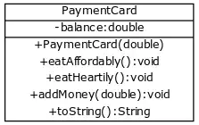

# Simple payment card system for student canteen

At the University of Helsinki student canteen, i.e. Unicafe, students pay for their lunch using a payment card. The final PaymentCard will look like the following as a class diagram:

